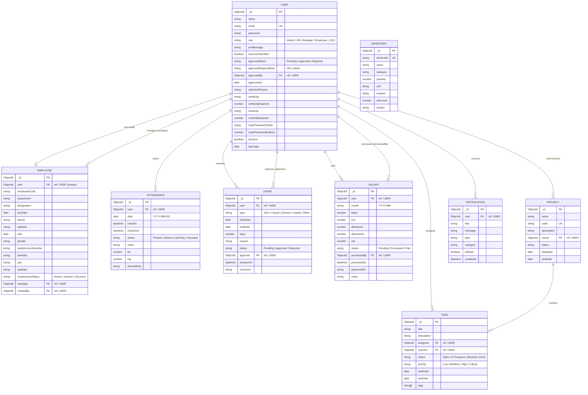

# BizFlow ERP - ER Diagram (Mermaid)

Paste this into any Mermaid-compatible viewer, or preview directly in VS Code with a Mermaid-enabled Markdown preview extension.

## How to view
- VS Code: install an extension like “Markdown Preview Mermaid Support”, then open `docs/erd.md` and preview.
- Online: copy the mermaid block into https://mermaid.live and render.
- GitHub/GitLab: many platforms render Mermaid in Markdown directly.
